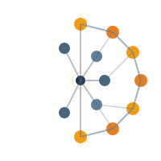

<div align="center">



# CIM-SemanticGraph-Platform


**Enterprise-grade platform for transforming CIM power system models into semantic knowledge graphs with GraphRAG and LLM integration**

[Features](#-features) • [Quick Start](#-quick-start) • [Documentation](#-documentation) • [API Reference](#-api-reference) • [Examples](#-examples)

</div>

---

## 📋 Table of Contents

- [Overview](#-overview)
- [Key Features](#-key-features)
- [Architecture](#-architecture)
- [Technology Stack](#-technology-stack)
- [Quick Start](#-quick-start)
- [Installation](#-installation)
- [Configuration](#-configuration)
- [Usage Examples](#-usage-examples)
- [API Reference](#-api-reference)
- [Load Flow Analysis](#-load-flow-analysis)
- [GraphRAG Chat](#-graphrag-chat)
- [Testing](#-testing)
- [CI/CD](#-cicd)
- [Monitoring](#-monitoring)
- [Project Structure](#-project-structure)
- [Contributing](#-contributing)
- [License](#-license)

---

## 🎯 Overview

**CIM-SemanticGraph-Platform** is a comprehensive, production-ready system that transforms **Common Information Model (CIM)** power system data into semantic knowledge graphs, enabling advanced analytics and intelligent decision support through GraphRAG (Graph Retrieval-Augmented Generation) and natural language processing.

### Problem Statement

Modern electrical grid digitalization requires standardized, interoperable models. The CIM (IEC 61970/61968) serves as the international standard, but direct exploitation of power system data remains limited without semantic transformation and intelligent context retrieval.

### Solution

This platform provides:
- **Semantic Transformation**: CIM → RDF/OWL knowledge graphs
- **Intelligent Querying**: Natural language interface via GraphRAG
- **Advanced Analytics**: Load flow calculations, impact analysis, consistency verification
- **Modern Visualization**: Interactive graph exploration
- **Multi-format Support**: CIM/XML, CIM/RDF, Excel import

---

## ✨ Key Features

### 🔄 Data Import & Transformation

- **Multi-format Support**
  - CIM/XML files (IEC 61970 standard)
  - CIM/RDF files (semantic web format)
  - Excel network files (user-friendly format)
  - Automatic format detection and conversion

- **Knowledge Graph Construction**
  - RDF/OWL triple generation
  - CIM ontology compliance (IEC 61970/61968)
  - Schema validation and integrity checks
  - Support for millions of triples

### 🧠 GraphRAG Intelligence

- **Context-Aware Retrieval**
  - Custom graph traversal algorithms
  - Semantic embedding generation
  - Intelligent subgraph extraction
  - Multi-hop relationship discovery

- **LLM Integration**
  - Groq API support (fast inference)
  - Ollama support (local LLM)
  - Claude AI integration (optional)
  - Natural language query processing
  - Contextual answer generation

### ⚡ Load Flow Analysis

- **Power System Calculations**
  - DC load flow solver
  - AC load flow (simplified)
  - Voltage and angle calculations
  - Branch power flow analysis
  - System loss computation
  - Violation detection

- **Interactive Analysis**
  - Calculate load flow via natural language
  - Query specific bus voltages
  - Analyze network conditions
  - Export results

### 🔍 Advanced Querying

- **SPARQL Query Engine**
  - SPARQL 1.1 support
  - Complex graph queries
  - OWL reasoning integration
  - Query validation and optimization

- **Natural Language Queries**
  - "What is the voltage at Düsseldorf 220kV?"
  - "Calculate load flow at bus Köln"
  - "Show all generators in the network"
  - "What equipment is affected if substation X fails?"

### 📊 Visualization & Analytics

- **Interactive Graph Visualization**
  - Cytoscape.js integration
  - Real-time network topology
  - Multiple layout algorithms
  - Node/edge filtering
  - Export to PNG

- **Dashboard Analytics**
  - Network statistics
  - Equipment counts
  - Triple store metrics
  - System health monitoring

### 🛡️ Data Validation

- **SHACL Validation**
  - Shape-based validation
  - Constraint checking
  - Detailed violation reports
  - CIM compliance verification

---

## 🏗️ Architecture

```
┌───────────────────────────────────────────────────────────────────┐
│                    Frontend Layer (React + TypeScript)            │
│  ┌──────────────┐  ┌──────────────┐  ┌──────────────┐             │
│  │  Dashboard   │  │ Graph Viewer │  │ GraphRAG Chat│             │
│  │  Statistics  │  │ Cytoscape.js │  │ LLM Interface│             │
│  └──────────────┘  └──────────────┘  └──────────────┘             │
│  ┌──────────────┐  ┌──────────────┐  ┌──────────────┐             │
│  │ Data Import  │  │ SPARQL Editor│  │ Load Flow    │             │
│  │ CIM/Excel    │  │ Query Builder│  │ Analysis     │             │
│  └──────────────┘  └──────────────┘  └──────────────┘             │
└────────────────────────────┬──────────────────────────────────────┘
                             │ REST API (JSON)
┌────────────────────────────┴─────────────────────────────────────┐
│              Backend Layer (Spring Boot 3.2)                     │
│  ┌───────────────────────────────────────────────────────────┐   │
│  │              REST Controllers                             │   │
│  │  - CIMController    - ExcelController                     │   │
│  │  - GraphRAGController - LoadFlowController                │   │
│  │  - SparqlController  - ShaclController                    │   │
│  └────────────┬─────────────────────────────┬────────────────┘   │
│               │                             │                    │
│  ┌────────────┴────────────┐   ┌────────────┴─────────────┐      │
│  │   GraphRAG Service      │   │   Load Flow Service      │      │
│  │  - Entity Retrieval     │   │  - Network Extraction    │      │
│  │  - Context Building     │   │  - Power Flow Solver     │      │
│  │  - LLM Integration      │   │  - Violation Detection   │      │
│  └────────────┬────────────┘   └───────────┬──────────────┘      │
│               │                            │                     │
│  ┌────────────┴────────────────────────────┴─────────────────┐   │
│  │   Apache Jena Fuseki (Remote SPARQL + OWL)                │   │
│  │  - External triple store (HTTP endpoint)                  │   │
│  │  - OWL reasoning & inference                              │   │
│  │  - SPARQL query/update APIs                               │   │
│  │  - CIM Ontology (IEC 61970/61968)                         │   │
│  └───────────────────────────────────────────────────────────┘   │
└──────────────────────────────────────────────────────────────────┘
                             │
                    ┌────────┴────────┐
                    │  External APIs  │
                    │  - Groq API     │
                    │  - Ollama       │
                    │  - Claude AI    │
                    └─────────────────┘
```

---

## 🛠️ Technology Stack

### Backend

| Technology | Version | Purpose |
|------------|---------|---------|
| **Java** | 17+ | Core language |
| **Spring Boot** | 3.2 | Application framework |
| **Apache Jena** | 4.10 | RDF/OWL processing, SPARQL |
| **Spring Security** | 3.2 | Security framework |
| **Maven** | 3.8+ | Build & dependency management |
| **JUnit 5** | 5.x | Testing framework |
| **Lombok** | Latest | Boilerplate reduction |

### Frontend

| Technology | Version | Purpose |
|------------|---------|---------|
| **React** | 18 | UI framework |
| **TypeScript** | 5.0 | Type safety |
| **Vite** | Latest | Build tool |
| **Cytoscape.js** | Latest | Graph visualization |
| **TailwindCSS** | Latest | Styling |
| **Axios** | Latest | HTTP client |

### Natural Language Processing

| Technology | Purpose |
|------------|---------|
| **GraphRAG** | Custom graph retrieval-augmented generation |
| **Groq API** | Fast language model inference |
| **Ollama** | Local language model support |
| **Claude** | Advanced language model (optional) |

### DevOps

| Technology | Purpose |
|------------|---------|
| **Docker** | Containerization |
| **Docker Compose** | Multi-container orchestration |
| **Maven Wrapper** | Build automation |

---

## 🚀 Quick Start

### Prerequisites

- **Java 17+** ([Download](https://adoptium.net/))
- **Maven 3.8+** ([Download](https://maven.apache.org/))
- **Node.js 18+** & **npm** ([Download](https://nodejs.org/))
- **Docker Desktop** (optional, [Download](https://www.docker.com/products/docker-desktop))

### Option 1: Docker Compose (Recommended)

```bash
# Clone repository
git clone https://github.com/yourusername/CIM-SemanticGraph-Platform.git
cd CIM-SemanticGraph-Platform

# Start all services
docker-compose up -d

# Access application
# Frontend: http://localhost:3000
# Backend API: http://localhost:8080
# API Docs: http://localhost:8080/swagger-ui.html
```

### Option 2: Manual Setup

1. **Start Apache Jena Fuseki (remote storage)**
   ```bash
   # Download once
   cd /tmp
   curl -L -o apache-jena-fuseki-4.10.0.tar.gz \
     https://archive.apache.org/dist/jena/binaries/apache-jena-fuseki-4.10.0.tar.gz
   tar xzf apache-jena-fuseki-4.10.0.tar.gz

   # Launch Fuseki with in‑memory dataset named "cim"
   cd apache-jena-fuseki-4.10.0
   ./fuseki-server --mem /cim
   ```
   Keep this terminal open. The backend will connect to `http://localhost:3030/cim`.

2. **Start the PowerFlow microservice**
   ```bash
   cd powerflow-service
   python3 -m uvicorn app.main:app --host 127.0.0.1 --port 8000
   ```
   This provides the load-flow REST API used by the platform.

3. **Start Backend**
   ```bash
   export JENA_FUSEKI_REMOTE_URL=http://localhost:3030
   export JENA_FUSEKI_DATASET=cim
   export GROQ_API_KEY=your_key            # optional but recommended
   cd backend
   ./mvnw spring-boot:run
   ```

4. **Start Frontend (new terminal)**
   ```bash
   cd frontend
   npm install
   npm run dev
   # Access: http://localhost:5173
   ```

---

## ⚙️ Configuration

### Backend Configuration

Edit `backend/src/main/resources/application.yml`:

```yaml
spring:
  application:
    name: cim-semantic-graph-platform

# Apache Jena Configuration
jena:
  storage-mode: remote
  fuseki:
    remote-url: ${JENA_FUSEKI_REMOTE_URL:http://localhost:3030}
    dataset-name: ${JENA_FUSEKI_DATASET:cim}

# GraphRAG Configuration
graphrag:
  retrieval:
    top-k: 10
    max-depth: 3
  context:
    max-triples: 1000

# LLM Configuration (choose one)
llm:
  provider: groq  # Options: groq, ollama, claude
  groq:
    api-key: ${GROQ_API_KEY}
    model: mixtral-8x7b-32768
  ollama:
    base-url: http://localhost:11434
    model: mistral
  claude:
    api-key: ${CLAUDE_API_KEY}
    model: claude-3-sonnet-20240229
```

### Environment Variables

```bash
# Mandatory external services
export JENA_FUSEKI_REMOTE_URL=http://localhost:3030
export JENA_FUSEKI_DATASET=cim
export POWERFLOW_SERVICE_URL=http://127.0.0.1:8000

# Groq API (recommended for fast inference)
export GROQ_API_KEY=your_groq_api_key

# Or Ollama (local, no API key needed)
# Just ensure Ollama is running: ollama serve

# Or Claude (optional)
export CLAUDE_API_KEY=your_claude_api_key
```

---

## 📖 Usage Examples

### 1. Import CIM Data

```bash
# Import CIM RDF file
curl -X POST http://localhost:8080/api/cim/import \
  -F "file=@test/cim/simple-network.rdf" \
  -F "format=rdf"

# Import CIM XML file
curl -X POST http://localhost:8080/api/cim/import \
  -F "file=@test/cim/medium-network.xml" \
  -F "format=xml"

# Import Excel network file
curl -X POST http://localhost:8080/api/excel/import \
  -F "file=@test/excel/test-simple-2bus.xlsx"
```

### 2. Query with SPARQL

```bash
curl -X POST http://localhost:8080/api/sparql/query \
  -H "Content-Type: application/json" \
  -d '{
    "query": "PREFIX cim: <http://iec.ch/TC57/CIM100#> SELECT ?sub ?name WHERE { ?sub a cim:Substation . ?sub cim:IdentifiedObject.name ?name }"
  }'
```

### 3. Natural Language Query (GraphRAG)

```bash
curl -X POST http://localhost:8080/api/graphrag/ask \
  -H "Content-Type: application/json" \
  -d '{
    "question": "What is the voltage at Düsseldorf 220kV?",
    "sessionId": "session-123"
  }'
```

### 4. Calculate Load Flow

```bash
# Full network load flow
curl -X POST http://localhost:8080/api/loadflow/calculate

# Load flow for specific bus
curl -X POST http://localhost:8080/api/loadflow/calculate/BUS_DUSSELDORF_220
```

---

## 🔌 Load Flow Analysis

The platform includes a comprehensive load flow analysis engine:

### Features

- **DC Load Flow Solver**: Fast, accurate power flow calculations
- **Bus Analysis**: Voltage magnitudes, angles, power injections
- **Branch Analysis**: Power flows, losses, loading percentages
- **Violation Detection**: Voltage limits, branch overloads
- **System Statistics**: Generation, load, losses summary

### Usage via Chat

Ask natural language questions:

- "Calculate load flow for the network"
- "What is the voltage at bus Köln 220kV?"
- "Calculate load flow at Düsseldorf"
- "Show me load flow results"

### API Endpoints

| Endpoint | Method | Description |
|----------|--------|-------------|
| `/api/loadflow/calculate` | POST | Calculate full network load flow |
| `/api/loadflow/calculate/{busId}` | POST | Calculate load flow for specific bus |
| `/api/loadflow/voltage/{busId}` | GET | Get voltage at specific bus |
| `/api/loadflow/statistics` | GET | Get system statistics |
| `/api/loadflow/violations` | GET | Get system violations |

---

## 💬 GraphRAG Chat

Interactive natural language interface for querying the knowledge graph:

### Features

- **Context-Aware Retrieval**: Intelligent subgraph extraction
- **Multi-provider Support**: Groq, Ollama, Claude
- **Session Management**: Chat history persistence
- **Load Flow Integration**: Calculate power flow via chat
- **Category Filtering**: Organize questions by type

### Example Queries

```
"Calculate load flow at bus Düsseldorf 220kV"
"What substations do we have in the network?"
"Show me all generators connected to the 380kV network"
"What is the total generation capacity?"
"Find all transmission lines between Köln and Düsseldorf"
```

---

## 🧪 Testing

### Backend Tests

```bash
cd backend
./mvnw test
```

### Frontend Tests

```bash
cd frontend
npm test
```

### Integration Tests

```bash
cd backend
./mvnw verify
```

### Test Files

Test files are located in the `test/` directory:

- **CIM Files**: `test/cim/` (RDF and XML formats)
- **Excel Files**: `test/excel/` (Network data in Excel format)

See [test/README.md](test/README.md) for details.

---

## 🧪 Testing

See [README_TESTING.md](README_TESTING.md) for detailed testing guide.

### Run Tests
```bash
# Backend
cd backend && mvn test

# Frontend
cd frontend && npm test
```

### Coverage
```bash
cd backend && mvn test jacoco:report
# Report: backend/target/site/jacoco/index.html
```

## 🚀 CI/CD

See [README_CI_CD.md](README_CI_CD.md) for CI/CD documentation.

The project uses GitHub Actions for:
- Automated testing on push/PR
- Code quality checks (linting, security)
- Docker image building and publishing
- Coverage reporting

## 📊 Monitoring

See [README_MONITORING.md](README_MONITORING.md) for monitoring setup.

### Actuator Endpoints
- Health: `/api/actuator/health`
- Metrics: `/api/actuator/metrics`
- Prometheus: `/api/actuator/prometheus`

## 📦 Project Structure

```
CIM-SemanticGraph-Platform/
├── backend/                          # Spring Boot backend
│   ├── src/main/java/com/cim/semanticgraph/
│   │   ├── config/                  # Configuration classes
│   │   ├── controller/              # REST controllers
│   │   │   ├── CimController.java
│   │   │   ├── ExcelController.java
│   │   │   ├── GraphRAGController.java
│   │   │   ├── LoadFlowController.java
│   │   │   ├── SparqlController.java
│   │   │   └── ShaclController.java
│   │   ├── service/                 # Business logic
│   │   │   ├── JenaService.java
│   │   │   ├── GraphRAGService.java
│   │   │   ├── LoadFlowService.java
│   │   │   ├── ExcelImportService.java
│   │   │   └── ShaclValidationService.java
│   │   ├── loadflow/                # Load flow engine
│   │   │   ├── extractor/
│   │   │   ├── model/
│   │   │   └── solver/
│   │   ├── graphrag/                # GraphRAG algorithms
│   │   └── dto/                     # Data Transfer Objects
│   └── src/main/resources/
│       └── application.yml          # Configuration
│
├── frontend/                         # React frontend
│   ├── src/
│   │   ├── pages/                   # Page components
│   │   │   ├── Dashboard.tsx
│   │   │   ├── GraphRAGChat.tsx
│   │   │   ├── LoadFlow.tsx
│   │   │   ├── SparqlEditor.tsx
│   │   │   └── DataImport.tsx
│   │   ├── components/               # Reusable components
│   │   │   └── GraphVisualization.tsx
│   │   ├── services/                # API services
│   │   └── types/                   # TypeScript types
│   └── package.json
│
├── test/                             # Test files
│   ├── cim/                         # CIM test files
│   ├── excel/                       # Excel test files
│   └── README.md                    # Test documentation
│
├── examples/                         # Example files
│   ├── cim-samples/                 # Sample CIM files
│   ├── NRW-Power-Network.xlsx       # NRW network example
│   └── rdf/                         # RDF examples
│
├── docs/                             # Documentation
│   └── diagrams/                    # Architecture diagrams
│
├── docker-compose.yml               # Docker orchestration
└── README.md                        # This file
```

---

## 📚 Documentation

- **[Test Files Guide](test/README.md)** - Test file formats and usage
- **[API Documentation](http://localhost:8080/swagger-ui.html)** - Interactive API docs (when running)
- **[Architecture Diagrams](docs/diagrams/)** - System architecture visualizations

---

## 🔌 API Reference

### CIM Management

| Endpoint | Method | Description |
|----------|--------|-------------|
| `/api/cim/import` | POST | Import CIM file (RDF/XML) |
| `/api/cim/export` | GET | Export knowledge graph |
| `/api/cim/statistics` | GET | Get graph statistics |
| `/api/cim/clear` | DELETE | Clear knowledge graph |
| `/api/cim/validate` | POST | Validate CIM file |

### Excel Import

| Endpoint | Method | Description |
|----------|--------|-------------|
| `/api/excel/import` | POST | Import Excel network file |
| `/api/excel/format` | GET | Get Excel format specification |

### GraphRAG

| Endpoint | Method | Description |
|----------|--------|-------------|
| `/api/graphrag/ask` | POST | Ask natural language question |
| `/api/graphrag/impact` | POST | Analyze equipment impact |
| `/api/graphrag/verify` | POST | Verify network consistency |
| `/api/graphrag/history` | GET | Get chat history |
| `/api/graphrag/history/{sessionId}` | GET | Get session history |

### SPARQL

| Endpoint | Method | Description |
|----------|--------|-------------|
| `/api/sparql/query` | POST | Execute SPARQL SELECT query |
| `/api/sparql/ask` | POST | Execute SPARQL ASK query |
| `/api/sparql/validate` | POST | Validate SPARQL query |
| `/api/sparql/samples` | GET | Get sample queries |

### Load Flow

| Endpoint | Method | Description |
|----------|--------|-------------|
| `/api/loadflow/calculate` | POST | Calculate full network load flow |
| `/api/loadflow/calculate/{busId}` | POST | Calculate load flow for bus |
| `/api/loadflow/voltage/{busId}` | GET | Get bus voltage |
| `/api/loadflow/statistics` | GET | Get system statistics |
| `/api/loadflow/violations` | GET | Get violations |

### SHACL Validation

| Endpoint | Method | Description |
|----------|--------|-------------|
| `/api/shacl/validate` | GET | Validate knowledge graph |
| `/api/shacl/shapes` | GET | Get SHACL shapes |
| `/api/shacl/validate/detailed` | POST | Detailed validation |

---

## 🤝 Contributing

Contributions are welcome! Please follow these steps:

1. Fork the repository
2. Create a feature branch (`git checkout -b feature/amazing-feature`)
3. Commit your changes (`git commit -m 'Add amazing feature'`)
4. Push to the branch (`git push origin feature/amazing-feature`)
5. Open a Pull Request

### Development Guidelines

- Follow Java and TypeScript coding standards
- Write unit tests for new features
- Update documentation
- Ensure all tests pass

---

## 📄 License

This project is licensed under the MIT License - see the [LICENSE](LICENSE) file for details.

---

## 🙏 Acknowledgments

- **IEC Technical Committee 57** - CIM standards (IEC 61970/61968)
- **Apache Jena** - RDF/OWL framework
- **Groq** - Fast language model inference
- **Ollama** - Local language model support
- **Anthropic** - Claude language models

---

## 📞 Support

For questions, issues, or support:

- **GitHub Issues**: [Open an issue](https://github.com/yourusername/CIM-SemanticGraph-Platform/issues)
- **Documentation**: See `docs/` directory

---

<div align="center">

**Built for intelligent power grid management**

[⭐ Star this repo](https://github.com/yourusername/CIM-SemanticGraph-Platform) • [📖 Documentation](docs/) • [🐛 Report Bug](https://github.com/yourusername/CIM-SemanticGraph-Platform/issues)

</div>
